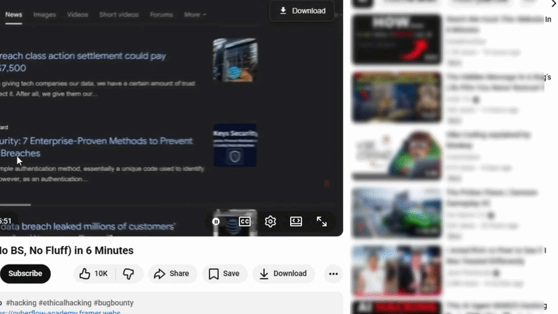

# YT Downloader Pro

[](LICENSE)
[](https://developer.chrome.com/docs/extensions/mv3/intro/)
[](https://github.com/yt-dlp/yt-dlp)
[](https://microsoft.com)

A premium, Windows-exclusive Chrome extension that integrates natively with [yt-dlp](https://github.com/yt-dlp/yt-dlp) to download YouTube videos in various qualities, featuring an elegant IDM-style overlay and real-time terminal output.



---

## ✨ Features

| Feature | Description |
|---------|-------------|
| **🎨 Modern UI** | Glassmorphism design with YouTube-native aesthetic |
| **⚡ Dual Interface** | Popup for full control + In-page overlay for quick access |
| **🎬 Quality Selection** | 360p to 4K (2160p), plus Audio-only (MP3) |
| **📜 Subtitles** | Auto-embed manual and auto-generated captions |
| **📂 Playlists** | Download entire playlists with organized folders |
| **🛡️ SponsorBlock** | Automatically remove sponsor segments |
| **💾 Smart Metadata** | Embeds thumbnails, chapters, and video info |
| **🔄 SPA Compatible** | Works seamlessly with YouTube's dynamic page navigation |
| **📊 Real-time Output** | Native terminal shows live download progress, speed, and ETA |

---

## 🚀 Installation

### Step 1: Install Native Component (Windows Backend)

1. Go to the **[Releases](../../releases/latest)** page on the right side of this repository.
2. Download `setup.bat`.
3. Right-click the downloaded file → **Run as Administrator**.
4. The installer automatically downloads and configures your isolated environment:
   - `yt-dlp.exe` (latest portable)
   - `ffmpeg.exe` + `ffprobe.exe` (format conversion)
   - Custom Windows protocol handler (`ytdlp://`)

### Step 2: Install Chrome Extension

Because this extension interfaces directly with your PC's command line, it is not hosted on the Chrome Web Store. You will install it locally:

1. Download `yt-downloader-extension.zip` from the **[Releases](../../releases/latest)** page.
2. Extract the folder to a safe place on your computer.
3. Open Chrome and navigate to `chrome://extensions/`.
4. Turn on **Developer mode** (toggle in the top-right corner).
5. Click **Load unpacked** in the top-left corner.
6. Select the folder you just extracted.

---

## 📖 Usage Guide

### Method 1: In-Page Overlay (Quick Access)
1. Hover your mouse over any YouTube video player.
2. Click the floating **Download** button in the top-right corner.
3. Select your quality from the dropdown menu.
4. The terminal opens immediately and begins downloading to your default folder.

### Method 2: Popup Interface (Full Control)
1. Navigate to any YouTube video or playlist.
2. Click the **YT Downloader Pro** puzzle piece icon in your Chrome toolbar.
3. Configure your save location, quality, and toggles.
4. Click **Launch Download**.

---

## ⚙️ Configuration & Tips

**Custom Save Paths**
Leave the save path blank in the extension menu to use the default `~/Downloads/YT-Downloads/` folder. For custom paths, use Windows formatting:
```batch
C:\Users\YourName\Videos\
D:\Downloads\YouTube\
```

**Speed Optimization**
You can modify the source code's generated command to include these flags for faster downloads:
```bash
--concurrent-fragments 5  # Download 5 fragments simultaneously
--buffer-size 16K         # Increase buffer size
```

---

## 🔒 Privacy & Security Policy

YT Downloader Pro operates with a strict **zero-data** philosophy.

**What We Don't Collect:**
- ❌ No personal information or browsing history.
- ❌ No analytics, telemetry, or download logs.
- ❌ No external server connections (completely serverless).

**Security Best Practices:**
- Uses a **Custom URI Protocol (`ytdlp://`)** with Base64 encoding to isolate the browser from the native shell.
- No persistent background scripts (utilizes the Manifest V3 service worker model).
- The extension uses its own private, sandboxed copy of yt-dlp to prevent conflicts with your global system variables.

---

## 📝 System Requirements

| Component | Minimum Version | Purpose |
|-----------|----------------|---------|
| **Windows** | 10 (1903+) | Native protocol support |
| **Browser** | Chrome/Edge 88+ | Manifest V3 support |
| **yt-dlp** | 2023.01.01+ | Core download engine |
| **FFmpeg** | 5.0+ | Format conversion |

---

## ❓ FAQ & Troubleshooting

**Q: Why does Windows Defender flag the installer?** A: The protocol handler registration (`setup.bat`) modifies the Windows Registry to teach Windows what a `ytdlp://` link is. Some antivirus software flags any registry modification as suspicious. The code is completely open-source, auditable, and safe to allow.

**Q: Can I use this on mobile Chrome?** A: No. Chrome on Android/iOS doesn't support the required APIs or native execution. This is strictly a desktop tool.

**Q: Why are 4K downloads slow?** A: YouTube actively throttles high-resolution downloads to save bandwidth. The extension uses yt-dlp's default optimizations, but 4K files are inherently massive and take time.

**Q: Terminal opens but closes immediately?** A: Ensure you ran `setup.bat` so the extension has access to its isolated copy of `yt-dlp.exe` and `ffmpeg.exe` inside your `%APPDATA%` folder.

---

## 🙏 Acknowledgments

- **[yt-dlp](https://github.com/yt-dlp/yt-dlp)** - The incredibly powerful core download engine.
- **[FFmpeg](https://ffmpeg.org/)** - The multimedia framework powering the format conversions.
- **[SponsorBlock](https://sponsor.ajay.app/)** - The crowdsourced database enabling automatic sponsor skipping.

---

## ⚖️ Legal Notice

**YT Downloader Pro** is an independent tool and is:
- **NOT** affiliated with YouTube LLC or Google LLC.
- **NOT** affiliated with the yt-dlp project.
- **NOT** a DRM circumvention tool.

**Disclaimer:** This extension is for personal use only. Respect copyright laws and YouTube's Terms of Service. Downloading copyrighted content without authorization violates YouTube's Terms of Service and potentially copyright law in your jurisdiction. The developers assume no liability for misuse.