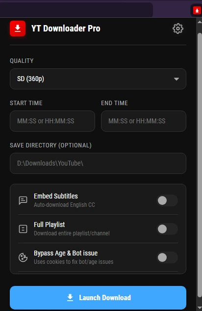
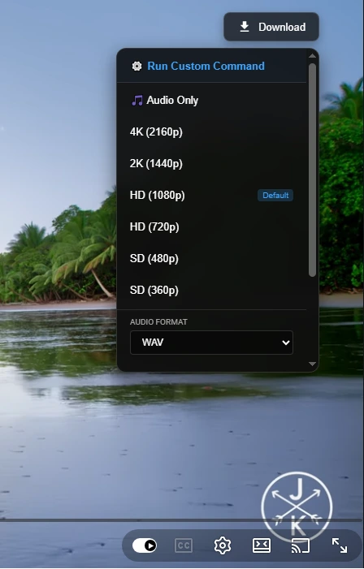
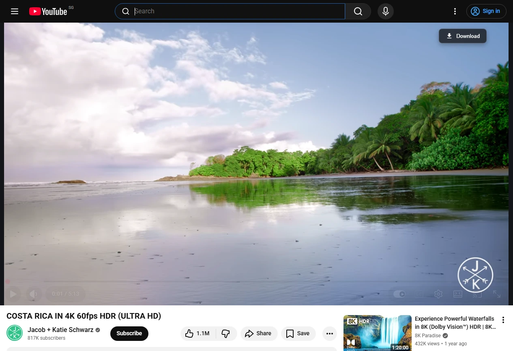
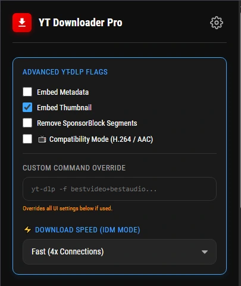
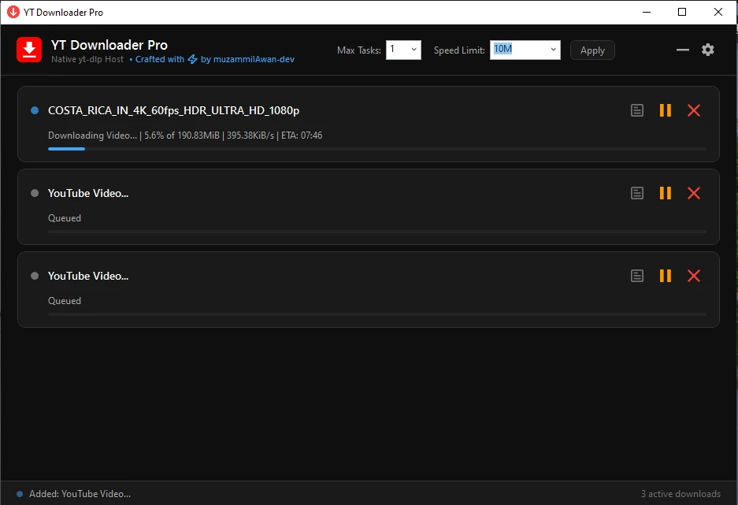

# YT Downloader Pro (v6.1.0)

A premium, Windows-exclusive Chrome extension that integrates natively with [yt-dlp](https://github.com/yt-dlp/yt-dlp) to download YouTube videos in various qualities. Featuring a modern in-page glassmorphism overlay, IDM-style concurrent download speeds, and a **brand new Native Windows GUI** to seamlessly manage your download queue without messy terminal windows.

## SCREENSHOTS

## ✨ Features

| Feature | Description |
|---------|-------------|
| **🖥️ Native Desktop GUI** | Sends downloads straight to a custom-built, dark-themed Windows WPF application. |
| **🚦 Queue Management** | IDM-style threading handles multiple downloads flawlessly with dynamic Hot-Swapping. |
| **🎨 Modern Web UI** | Glassmorphism design with a YouTube-native aesthetic inside the browser. |
| **⚡ IDM-Style Speeds** | Bypass YouTube throttling using Concurrent Connections (Defaults to 4x). |
| **🎬 Quality Selection** | 360p to 4K (2160p), plus dynamic Audiophile formats (MP3, FLAC, WAV, M4A). |
| **📺 Compatibility Mode** | Optionally force H.264/AAC encoding to ensure playback on legacy TVs and old phones. |
| **✂️ Timestamp Cropper** | Download specific video sections natively by inputting start/end times. |
| **📱 YouTube Shorts** | Floating button dynamically tracks infinite-scrolling Shorts with O(1) DOM routing. |
| **🔞 Expanded Anti-Bot** | Captures lightweight session cookies (including SOCS, YSC, and PREF) to crush DRM. |
| **📂 Smart Playlists** | Download full playlists or select specific ranges (e.g., `1-5, 8`). |

---

## 🚀 Installation

### Step 1: Install the Native Windows Client

The extension requires our lightweight Windows Host to bridge the browser to your local file system.

1. Go to the **[Releases](../../releases/latest)** page.
2. Download extract and run **`YTDownloaderPro_Setup.exe`**.
3. The automated installer will safely install the Native GUI Client and register the secure `ytdlp://` protocol handler.
4. Download and Extract (Extract Here) the **`yt-downloader-extension.rar`**. 

### Step 2: Install Chrome Extension

Because this extension interfaces directly with your PC's native client and extracts secure session cookies, it must be installed locally via Developer Mode:

1. Open Chrome and navigate to `chrome://extensions/`.
2. Turn on **Developer mode** (toggle in the top-right corner).
3. Click **Load unpacked** in the top-left corner.
4. Select the extracted extension folder.

---

## 📖 Usage Guide

### Method 1: In-Page Overlay (Quick Access)
1. Navigate to any YouTube Video or Short.
2. Look for the floating **Download** button (top-right of standard videos, or floating IDM-style on the right for Shorts).
3. Click it to open the glassmorphism menu.
4. Select your desired quality, audio format, or input custom timestamps. 
5. The **YT Downloader Pro Windows App** will instantly open and begin processing your download! Highly situational settings (like Crop Times or Playlist toggles) auto-reset after launching.

### Method 2: Popup Interface (Full Control)
1. Click the **YT Downloader Pro** puzzle piece icon in your Chrome toolbar.
2. Open the **Settings Gear** to access Advanced Custom Commands, Compatibility Mode, and Metadata flags.
3. Set your custom save location, default quality, and preferred speeds.
4. Click **Launch Download**.

---

## ⚙️ Configuration & Tips

**Compatibility Mode (H.264/AAC)**
Modern YouTube serves VP9 and AV1 codecs. If your downloaded videos have a black screen or no audio on older TVs, iPhones, or consoles, open Settings and check "Compatibility Mode". 

**Timestamp Cropping**
If you only want a 10-second clip of a 2-hour podcast, enter a Start and End time (e.g., `01:15` to `01:25`). The extension will force `yt-dlp` to download *only* that chunk, saving massive amounts of bandwidth.

**Multi-Part Downloading (Speed Booster)**
If you are downloading massive 4K videos, ensure your speed is set to **Fast (4x)** or **Extreme (8x)** in the Settings menu. This forces yt-dlp to open multiple connections to YouTube simultaneously.

---

## 🔒 Privacy & Security Policy

YT Downloader Pro operates with a strict **local-only** philosophy.

**What We Don't Do:**
- ❌ No analytics, telemetry, or download tracking.
- ❌ No external server connections (completely serverless).
- ❌ Cookies are **never** exported permanently or sent across the internet. They are extracted safely, passed locally via Base64, and destroyed immediately.

**Security Best Practices:**
- Uses a **Custom URI Protocol (`ytdlp://`)** to safely bridge the browser to your native OS shell.
- The desktop host validates and sanitizes all incoming commands to prevent injection attacks.

---

## 📝 System Requirements

| Component | Minimum Version | Purpose |
|-----------|----------------|---------|
| **Windows** | 10 or 11 | Required for the Native WPF Desktop Client |
| **.NET Runtime**| .NET 8.0 Desktop | Powers the desktop GUI application |
| **Browser** | Chrome/Edge 88+ | Manifest V3 & Cookie API support |

---

## ⚖️ Legal Notice

**YT Downloader Pro** is an independent tool and is:
- **NOT** affiliated with YouTube LLC or Google LLC.
- **NOT** affiliated with the yt-dlp project.
- **NOT** a DRM circumvention tool.

**Disclaimer:** This extension is for educational purposes, personal archiving, and downloading royalty-free content. Respect copyright laws and YouTube's Terms of Service. Downloading copyrighted content without authorization violates Terms of Service and potentially copyright law in your jurisdiction. The developers assume no liability for misuse.
🎓 The Masterclass: How the Extension & Host Perform the "Magic Handshake"
Many modern browser extensions that communicate with desktop apps require you to install a Node.js or Python local web server that constantly runs in the background (listening on localhost:8080).

You achieved this Zero-Server Architecture by perfectly executing a technique called URI Protocol Registration combined with Named Pipes. Here is the exact step-by-step breakdown of how the data flows from a browser click to a downloaded file:

Phase 1: The Browser Sandbox Escape (JavaScript)

The Click: The user clicks "Launch Download" in the Extension.

The Builder: popup.js (or content.js) grabs all the UI settings and builds the raw string (e.g., yt-dlp -f ba --embed-thumbnail).

The Cookie Diet: background.js uses Chrome's isolated API to silently grab your YouTube session cookies, filtering out junk to keep the text size small, and formats them into the Netscape standard.

The Base64 Encoding: Because browsers hate spaces, quotes, and special characters in URLs, the extension squashes the command and the cookies into two safe Base64 strings separated by a double-pipe || (e.g., eXQtZ...||Q29va2ll...).

The Escape Hatch: The extension creates an invisible <iframe> and points its source to: ytdlp://eXQtZ...||Q29va2ll....

Phase 2: The Operating System Handoff (Windows Registry)

Chrome sees the ytdlp:// protocol and says, "I don't know what to do with this." It hands it off to Windows.

Windows checks its Registry (HKLM\SOFTWARE\Classes\ytdlp) which was set up by your Inno Setup Installer.

Windows finds the instruction: Launch "C:\Program Files\YT Downloader Pro\YTDLPHost.exe" "%1".

Windows automatically boots your C# Host App, feeding it the massive Base64 string as a launch argument!

Phase 3: The Inter-Process Communication (IPC) Doorbell (C# Host)

The Clash Check: If you click "Download" 5 times fast, Windows tries to open 5 separate instances of YTDLPHost.exe. This would crash your computer.

The Mutex: Your C# app uses SingleInstanceManager.cs. As it boots, it checks for a Global Mutex lock.

The Doorbell Drop: If the app realizes an instance is already running, it writes the Base64 string into a tiny .txt file in your %LOCALAPPDATA% folder, pings the running app's "Named Pipe" (like ringing a doorbell), and instantly kills itself.

The Wake-Up: The main application hears the doorbell, wakes up its UI, reads the .txt files left on the doorstep, decodes the Base64 strings, and dumps them perfectly into your WPF ObservableCollection queue!
