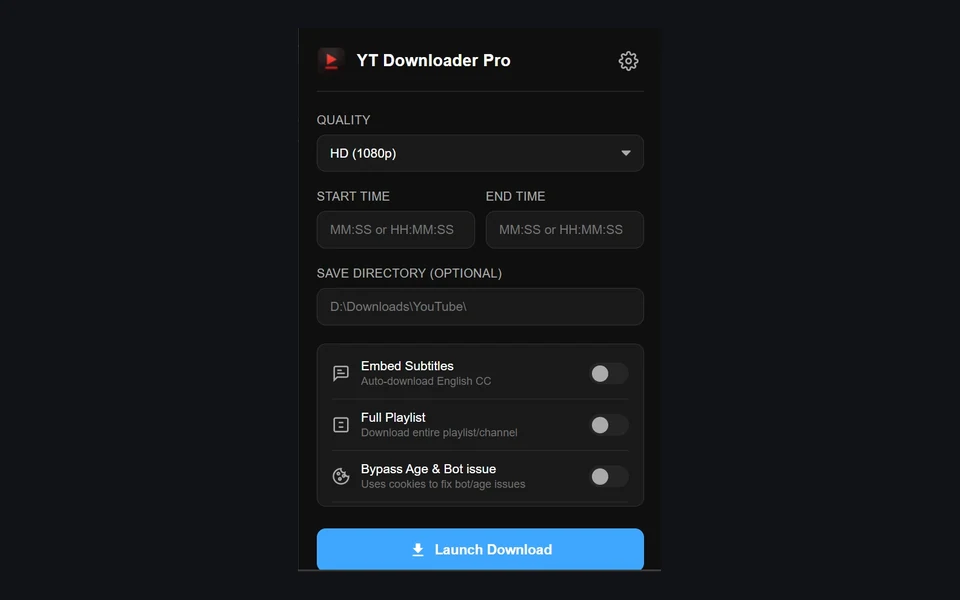
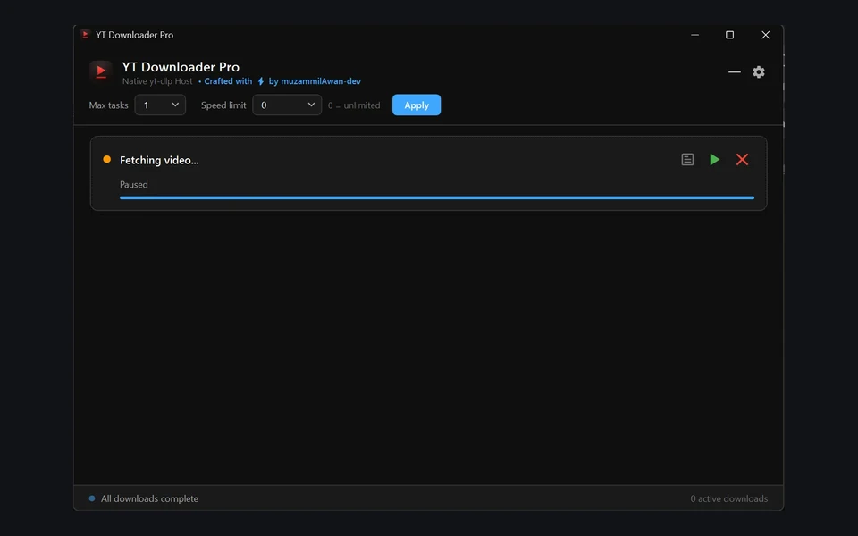
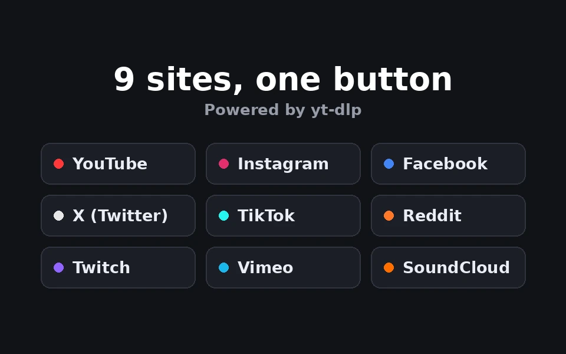
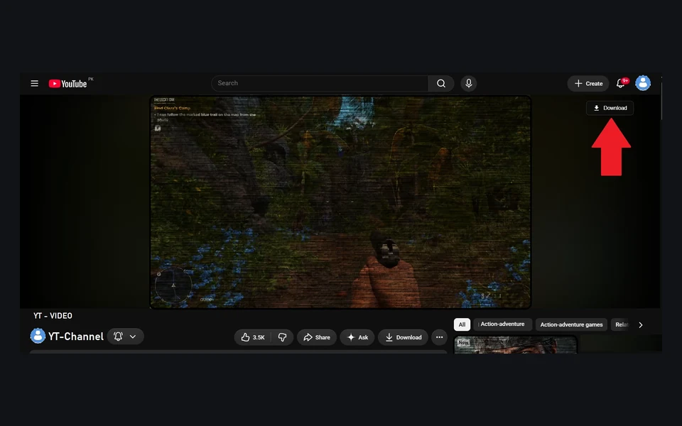
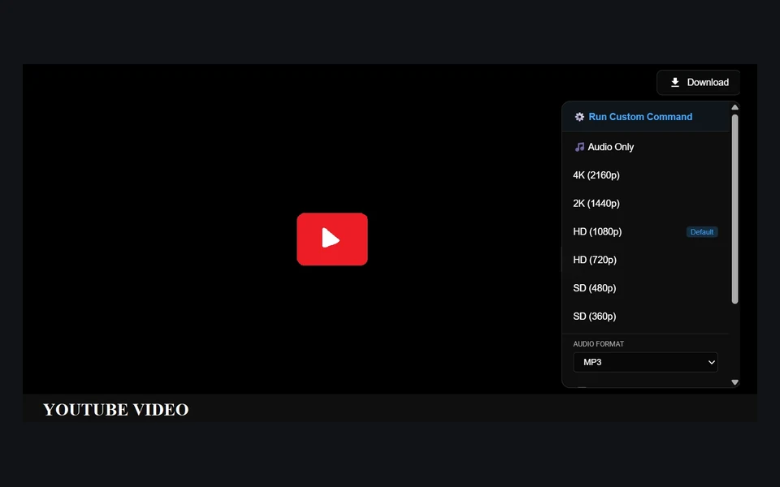
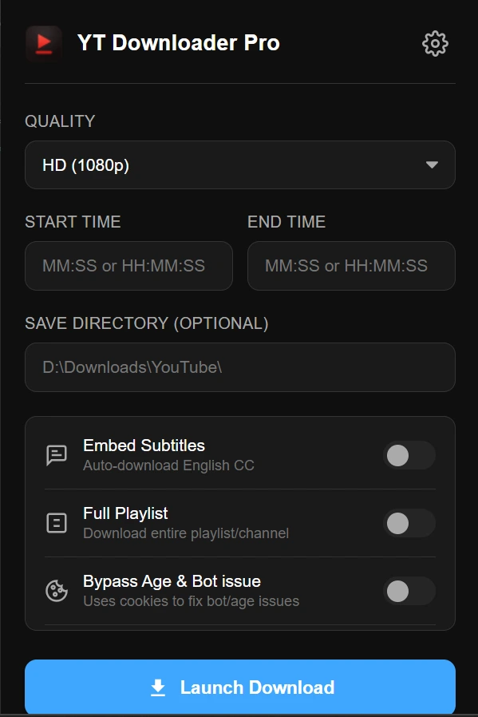
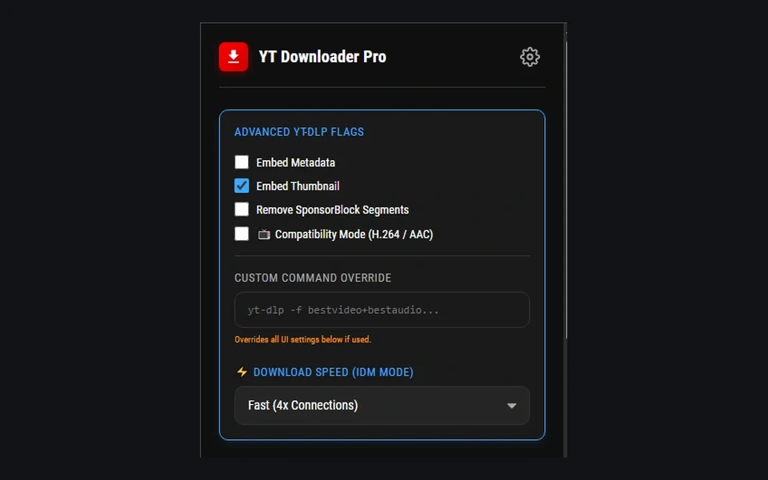
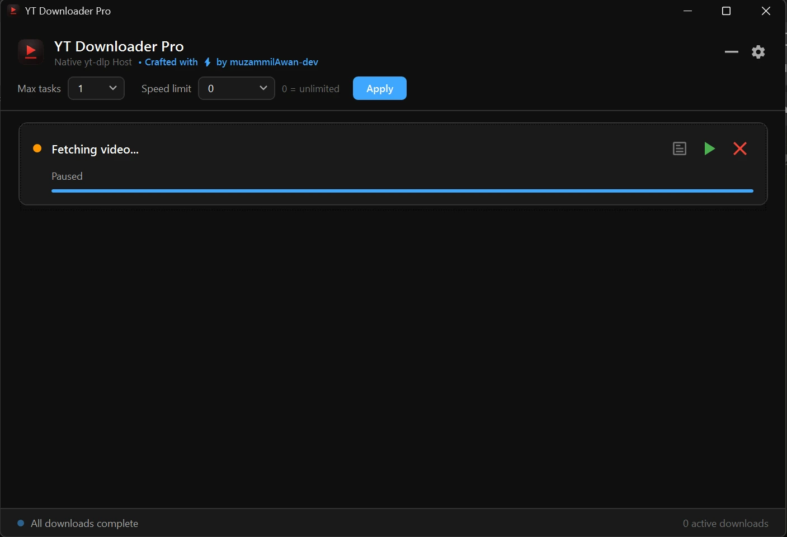

# YT Downloader Pro

[](../../actions/workflows/build.yml)
[](LICENSE)
[](https://developer.chrome.com/docs/extensions/mv3/intro/)
[](https://github.com/yt-dlp/yt-dlp)
[](https://microsoft.com)

A premium, Windows-exclusive **Chrome extension + native desktop host**, built around [yt-dlp](https://github.com/yt-dlp/yt-dlp), for downloading videos in any quality from YouTube, Instagram, Facebook, X, TikTok, Reddit, Twitch, Vimeo and SoundCloud ([details](#-supported-sites)). This repo contains both halves of the product:

| Component | What it is | Lives in |
|---|---|---|
| **Browser Extension** | Manifest V3 extension (Chrome, Edge, Brave, Opera): small download button that follows the video in view, popup UI, image saving, cookie/session capture | [`extension/`](extension) |
| **Native Host (YTDLPHost)** | .NET 8 WPF desktop app: receives `ytdlp://` links, checks them against an allowlist, runs `yt-dlp`/`ffmpeg`/`deno` in a queue, dark-themed GUI | [`host/`](host) |

They're released and versioned together from this single repo.

## Screenshots

<sub>Click any screenshot to open it full size.</sub>

<table>
  <tr>
<<<<<<< HEAD
    <td align="center" valign="top"><a href="extension/docs/2.webp"></a><br><sub><b>One-click button</b><br>Sits on the video, never in the way</sub></td>
    <td align="center" valign="top"><a href="extension/docs/3.webp"></a><br><sub><b>Quality &amp; format menu</b><br>4K down to audio-only</sub></td>
    <td align="center" valign="top"><a href="extension/docs/1.webp"></a><br><sub><b>Toolbar popup</b><br>Trim, subtitles, playlists, save folder</sub></td>
  </tr>
  <tr>
    <td align="center" valign="top"><a href="extension/docs/4.webp"></a><br><sub><b>Advanced options</b><br>Speed, metadata, custom command</sub></td>
    <td align="center" valign="top"><a href="extension/docs/5.webp"></a><br><sub><b>Desktop host</b><br>Queue, speed limit, live progress</sub></td>
    <td align="center" valign="top"><a href="#-supported-sites"></a><br><sub><b>Multi-site</b><br>YouTube, Instagram, Facebook and more</sub></td>
=======
    <td colspan="2" align="center" valign="top"><a href="extension/docs/2.webp"></a><br><sub><b>One-click button</b><br>Sits on the video, never in the way</sub></td>
    <td colspan="2" align="center" valign="top"><a href="extension/docs/3.webp"></a><br><sub><b>Quality &amp; format menu</b><br>4K down to audio-only</sub></td>
    <td colspan="2" align="center" valign="top"><a href="extension/docs/1.webp"></a><br><sub><b>Toolbar popup</b><br>Trim, subtitles, playlists, save folder</sub></td>
  </tr>
  <tr>
    <td colspan="1"></td>
    <td colspan="2" align="center" valign="top"><a href="extension/docs/4.webp"></a><br><sub><b>Advanced options</b><br>Speed, metadata, custom command</sub></td>
    <td colspan="2" align="center" valign="top"><a href="extension/docs/5.webp"></a><br><sub><b>Desktop host</b><br>Queue, speed limit, live progress</sub></td>
    <td colspan="1"></td>
>>>>>>> 55c4dd46e38f2ebfa3d724fb501b669c08f8070c
  </tr>
</table>

## ✨ Features

| Feature | Description |
|---|---|
| 🖥️ Native Desktop GUI | Sends downloads to a custom-built, dark-themed WPF host app |
| 🚦 Queue Management | IDM-style concurrent downloads with dynamic hot-swapping of speed/thread settings |
| 🌐 Multi-site | YouTube, Instagram, Facebook, X, TikTok, Reddit, Twitch, Vimeo and SoundCloud, each with its own on/off switch |
| 🎯 Follows what you watch | On feeds, Reels and Shorts a small floating button tracks the video in view, so it always downloads *that* one |
| 🖼️ Photo posts | Instagram, Facebook and X photos save in one click (full size on X) to `Downloads/YT Downloader Pro` |
| 🎨 Modern Web UI | Compact glassmorphism overlay and a dark-themed desktop app |
| ⚡ IDM-Style Speeds | Bypass YouTube throttling via concurrent connections (default 4x) |
| 🎬 Quality Selection | 360p up to 4K (2160p), plus MP3 / FLAC / WAV / M4A audio |
| 📺 Compatibility Mode | Forces H.264/AAC for playback on legacy TVs and phones |
| ✂️ Timestamp Cropper | Download only a specific start/end section of a video |
| 📱 Shorts & Reels | Floating button tracks infinite-scrolling Shorts, Reels and TikToks |
| 📂 Smart Playlists | Full playlists or specific ranges (e.g. `1-5, 8`) |
| 🔁 Smart Auto-Recovery | Debounced JSON queue state survives crashes/restarts |
| 🔐 Hardened handoff | The host only accepts allowlisted `yt-dlp` options, safe output paths and http(s) links |
| 🛡️ Anti-Bot Shield | Bundles the Deno JS engine to bypass YouTube's signature puzzles |

## 🌐 Supported sites

The extension adds its download button on these sites. Downloading itself is done by yt-dlp, so anything yt-dlp can fetch from them works.

| Site | What you can save | Status / notes |
|---|---|---|
| **YouTube** | Videos, Shorts, playlists, audio-only | Stable, the most tested |
| **Instagram** | Reels, video posts, photos | Works; log in for best results |
| **Facebook** | Reels, videos, photos | Works; log in recommended. Facebook's page layout is heavily obfuscated, so it can be less reliable |
| **X (Twitter)** | Videos, GIFs, photos (full size) | Experimental |
| **TikTok** | Videos | Experimental; TikTok changes its markup often |
| **Reddit** | Videos | Experimental |
| **Twitch** | VODs and clips | Basic support |
| **Vimeo** | Videos | Basic support |
| **SoundCloud** | Tracks (audio) | Basic support |

- Turn individual sites on or off in the popup under **Settings → Supported sites**.
- On feeds, Reels and Shorts the button floats over the video in view; open a post on its own page if a link can't be found.
- Private, paid or DRM-protected content is not supported.
- Sites change their layout often. If a button stops appearing, press **Ctrl+Shift+Y** on the page to export the debug log and attach it to a GitHub issue.

## 🚀 Installation

### 1. Install the native host

1. Go to [Releases](../../releases/latest) and download `YTDownloaderPro_Setup.exe`.
2. Run it. This installs the WPF host to `C:\Program Files\YT Downloader Pro` and registers the `ytdlp://` protocol.
3. On first launch, the host silently fetches `yt-dlp`, `ffmpeg`, and `deno` into `%LOCALAPPDATA%\YTDownloaderProEngine`.

### 2. Install the browser extension

Because this extension talks to the native host and reads session cookies, it must be loaded unpacked:

1. Download the `extension.zip` file and extract it to a folder on your computer.
2. Open your Chromium-based browser (such as **Google Chrome**, **Microsoft Edge**, **Brave**, or **Opera**):
   - **Chrome / Brave:** Navigate to `chrome://extensions/`
   - **Edge:** Navigate to `edge://extensions/`
   - **Opera:** Navigate to `opera://extensions`
3. Enable **Developer mode** using the toggle switch (usually found in the top-right corner of the extensions page).
4. Click **Load unpacked** (or **Load unpacked extension**).
5. Select the **main root extension folder** (the specific folder containing the `manifest.json` file). 
   - *Important:* Make sure you select the folder containing the manifest directly, rather than any parent or outer folder, otherwise the extension will fail to load or throw an error.

## 📖 Usage

**In-page overlay:** open a video (or scroll a feed, Reels or Shorts) → click the small **Download** button on the video → pick quality/format/timestamps → the host app opens and starts the download. On a photo post the button saves the image directly.

**Popup:** click the toolbar icon → open **Settings** for advanced flags, compatibility mode, custom commands, and speed → **Launch Download**. The popup downloads whatever the floating button would (the video or photo in view), not just the tab's address.

## ⚙️ Configuration tips

- **Compatibility Mode (H.264/AAC):** turn on if downloads show a black screen or no audio on older TVs/phones (modern YouTube serves VP9/AV1 by default).
- **Timestamp cropping:** enter start/end (e.g. `01:15`–`01:25`) to download only that clip instead of the whole video.
- **Instagram / Facebook / X:** these usually need you to be logged in. Enable "Bypass Age & Bot issue" so your browser session is passed to the download.
- **No sound in a downloaded file:** video and audio are merged with `ffmpeg`. Check that `%LOCALAPPDATA%\YTDownloaderProEngine` contains `ffmpeg.exe`.
- **Multi-connection speed:** for large 4K files, set speed to Fast (4x) or Extreme (8x) in Settings.

## 🔍 How it works (Browser → OS → Host)

1. **Extension:** `popup.js`/`content.js` build a `yt-dlp ...` command string, `background.js` grabs the needed session cookies, both get Base64-encoded and joined as `ytdlp://<command>||<cookies>||<user-agent>` (the last two only when cookies are needed), fired via a hidden `<iframe>`.
2. **OS handoff:** Windows resolves the `ytdlp://` protocol from the registry and launches `YTDLPHost.exe "<payload>"`.
3. **Single instance:** if the host is already running, the new process drops the payload into `%LOCALAPPDATA%\YT Downloader Pro\Payloads`, pings the running instance's named pipe as a "doorbell," and exits — no duplicate windows, no orphaned processes.
4. **Execution:** the primary instance decodes, validates against an allowlist (see below), and queues the task, then runs `yt-dlp.exe` in a sandboxed, console-free child process with live progress parsed straight into the WPF UI.

## 🔒 Privacy & Security

- **Local-only:** no analytics, telemetry, or external servers besides the sites you download from and the yt-dlp/ffmpeg/deno downloads themselves.
- Session cookies are captured only when you enable "Bypass Age & Bot issue," passed locally via Base64, written to a temp file for the duration of that download, and deleted immediately after — they are never committed to the queue's persisted history.
- Any web page can open a `ytdlp://` link, so the payload is treated as untrusted. `CommandValidator` accepts only the `yt-dlp` options the extension actually uses, requires every other argument to be an http(s) link, and only allows output files with a media extension in a normal folder (no `..`, network shares, system or startup folders, or the engine folder). Anything else is blocked and the reason is logged.
- Your browser asks before opening the app the first time. Ticking "Always allow" is convenient, and the validator is what keeps that safe.
- Photos are saved with the browser's own download manager; nothing is uploaded anywhere.

## 🗑️ Uninstallation

Settings → Apps → Installed Apps → uninstall **YT Downloader Pro**. This removes the host binaries, unregisters the protocol handler, and wipes the dynamic `%LOCALAPPDATA%` engine/payload folders. Remove the browser extension separately from your browser's extensions page (`chrome://extensions/`, `edge://extensions/`, etc.).

## 🛠️ Building from source

```
git clone https://github.com/muzammilAwan-dev/yt-downloader-pro.git
cd yt-downloader-pro

# Host app (requires .NET 8 SDK, Windows)
dotnet build host/YTDLPHost.sln --configuration Release

# Installer (requires Inno Setup, Windows) - optional, only if packaging a setup.exe
iscc "host/installer/setup.iss"
```

CI (`.github/workflows/build.yml`) builds and publishes `YTDLPHost.exe` as a GitHub Actions artifact on every push to `host/**`. Build outputs (`bin/`, `obj/`, `publish/`, `installer/Output/`) are not committed — see `.gitignore`.

## 📁 Repository structure

```
yt-downloader-pro/
├── .github/workflows/build.yml   # CI: build + publish YTDLPHost.exe
├── extension/                    # Chrome extension (Manifest V3)
│   ├── docs/                     # Full-size screenshots (thumbs/ = equal-size README tiles)
│   ├── icons/
│   ├── background.js
│   ├── content.js / content.css
│   ├── logger.js
│   ├── manifest.json
│   ├── popup.html / popup.js
│   └── sites.js                  # Per-site rules (URL matching, feed and photo options)
├── host/                         # Native Windows GUI host
│   ├── YTDLPHost.sln
│   ├── YTDLPHost/
│   │   ├── Assets/                (icon.ico)
│   │   ├── Converters/
│   │   ├── Models/                (AppSettings, DownloadTask)
│   │   ├── Services/              (AppLogger, CommandValidator, HistoryManager,
│   │   │                           ProtocolHandler, SingleInstanceManager,
│   │   │                           TrayIconService, YtDlpRunner)
│   │   ├── ViewModels/            (MainViewModel, DownloadItemViewModel)
│   │   ├── App.xaml(.cs)
│   │   ├── MainWindow.xaml(.cs)
│   │   └── YTDLPHost.csproj
│   └── installer/                 # Inno Setup packaging (renamed from "YTDLP_Installer maker")
│       ├── Assets/icon.ico
│       └── setup.iss
├── tools/make_thumbs.py          # Rebuilds the equal-size README screenshot tiles
├── .gitignore
├── LICENSE
└── README.md
```

## 🖼️ Adding screenshots

Originals live in `extension/docs/<n>.webp`. Drop a new one there, run `python tools/make_thumbs.py` (needs `pip install pillow`) to regenerate the equal-size tiles in `extension/docs/thumbs/`, then swap it into a cell of the Screenshots table (the last cell is a generated "Multi-site" tile you can replace with an Instagram or Facebook capture).

## ⚖️ Legal Notice

**YT Downloader Pro** is an independent tool, **not affiliated** with YouTube/Google, Meta, X, TikTok, Reddit or the yt-dlp project, and is **not** a DRM circumvention tool.

For educational purposes, personal archiving, and royalty-free content only. Respect copyright law and each site's Terms of Service — downloading copyrighted content without authorization may violate both. The developers assume no liability for misuse.

## License

[MIT](LICENSE) © 2026 Muhammad Muzammil
